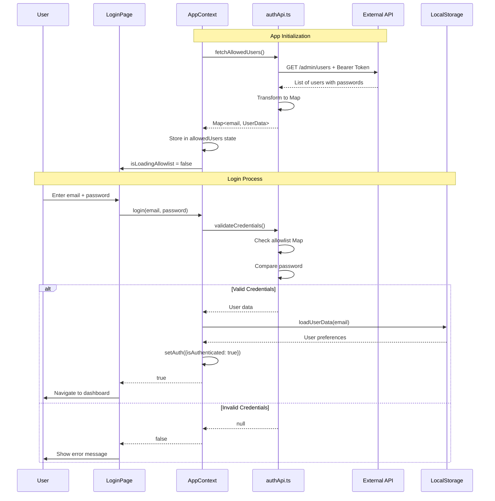

# Authentication System

## Overview

The admin panel uses **API-based authentication** where users are fetched from the external API and validated against an in-memory allowlist.

## How It Works

### 1. App Initialization

When the app loads:

```
AppContext.tsx → fetchAllowedUsers() → GET /admin/users
    ↓
Transform API response to Map<email, UserData>
    ↓
Store in React state (allowedUsers)
    ↓
Ready for login validation
```

### 2. Login Flow

When a user attempts to log in:

```
User enters credentials
    ↓
LoginPage → login(email, password)
    ↓
validateCredentials(email, password, allowedUsers)
    ↓
Check if email exists in allowlist
    ↓
Compare password (plain text comparison)
    ↓
If valid: Load user preferences from localStorage
    ↓
Set auth.isAuthenticated = true
    ↓
Navigate to dashboard
```

### 3. Session Management

- **Authentication State**: Managed by AppContext (React state)
- **User Preferences**: Stored in localStorage (trips, styles, moods)
- **Allowlist**: In-memory only, refreshed on each app load

## Architecture



## Files Involved

### [`src/lib/authApi.ts`](src/lib/authApi.ts)
API service for authentication:
- `fetchAllowedUsers()`: Fetches users from `/admin/users` endpoint
- `validateCredentials()`: Validates email/password against allowlist
- Uses environment variables for API URL and token

### [`src/context/AppContext.tsx`](src/context/AppContext.tsx)
Authentication state management:
- `allowedUsers`: Map of email to user data (in-memory)
- `isLoadingAllowlist`: Loading state for allowlist fetch
- `allowlistError`: Error message if fetch fails
- `login()`: Validates credentials and sets authentication state
- `retryFetchAllowlist()`: Retry fetching allowlist on error

### [`src/pages/LoginPage.tsx`](src/pages/LoginPage.tsx)
Login UI:
- Shows loading indicator while fetching allowlist
- Displays error banner if allowlist fetch fails
- Provides "Retry" button for failed fetches
- Disables login button while loading

## User Requirements

To log in, users must:
1. Exist in the `/admin/users` API endpoint
2. Have a valid `email` field
3. Have a `password` field that matches their credentials

**Important**: There is no registration flow. Admins must add users via the Users management page first.

## API Response Format

The `/admin/users` endpoint should return users in this format:

```json
[
  {
    "_id": "user123",
    "email": "admin@example.com",
    "password": "SecurePass123",
    "name": "Admin User",
    "firstName": "Admin",
    "lastName": "User",
    "phone": "+1234567890",
    "dateOfBirth": "1990-01-01",
    "gender": "male"
  }
]
```

**Required fields:**
- `email`: User's email address (used as username)
- `password`: User's password (plain text in response)

**Optional fields:**
- `name`, `firstName`, `lastName`: Display name
- `phone`, `dateOfBirth`, `gender`: Additional user info

## Security Considerations

### Password Handling
- Passwords are compared as plain text in the frontend
- Ensure the external API properly hashes/encrypts passwords in storage
- Consider implementing proper authentication tokens in the future

### Allowlist Security
- Stored in React state (memory), not localStorage
- Automatically cleared when browser closes
- Refreshed on each app load
- Not accessible via browser dev tools after session ends

### Token Security
- API Bearer token stored in `.env.local`
- Git-ignored to prevent committing secrets
- Used for all API requests

### Session Management
- User remains authenticated until:
  - They explicitly log out
  - Browser is refreshed (requires re-login)
  - Browser is closed

## Error Handling

### Allowlist Fetch Failures

If the API fails to fetch the allowlist:
1. Shows yellow warning banner on login page
2. Displays error message
3. Provides "Retry" button
4. Login button remains disabled until successful fetch

### Invalid Credentials

If user enters wrong email/password:
1. Shows red error message
2. Does not reveal whether email or password is incorrect (security)
3. User can retry immediately

### API Unavailable

If the external API is completely unavailable:
1. Warning banner shows on login page
2. Login is disabled until API is reachable
3. User can click "Retry" to attempt reconnection

## Testing

### Test Valid Login
1. Start the app
2. Wait for "Loading user authentication..." to complete
3. Enter valid credentials from `/admin/users` API
4. Should navigate to dashboard

### Test Invalid Login
1. Enter email not in API: "Invalid credentials"
2. Enter wrong password: "Invalid credentials"
3. Enter invalid email format: Validation error

### Test API Failure
1. Stop the backend proxy or API
2. Login page should show warning banner
3. Click "Retry" button
4. Should attempt to reload allowlist

### Test Loading States
1. Slow network: Should show loading spinner
2. Login button should be disabled during load
3. Should show "Loading..." text on button

## Migration from Old System

### What Changed
- **Before**: Credentials stored in localStorage via `storage.getRegisteredUsers()`
- **After**: Credentials fetched from API and cached in memory

### What Stayed the Same
- User preferences (trips, styles, moods) still in localStorage
- Session management works the same
- Protected routes unchanged
- Logout functionality unchanged

### Breaking Changes
- Users created via old registration flow won't work anymore
- Must add users through Users management page
- Users must exist in API to log in

## Troubleshooting

### "Loading user authentication..." never completes
**Cause**: API not responding or network issue
**Solution**: 
1. Check `.env.local` has correct API URL
2. Verify API token is valid (not expired)
3. Check network tab for failed requests
4. Click "Retry" button

### "No users found in allowlist"
**Cause**: API returned empty array or no users
**Solution**:
1. Add users via Users management page (requires separate admin access)
2. Verify API endpoint returns user list
3. Check API authentication token is valid

### "Invalid credentials" for known good password
**Cause**: Password mismatch or email not in allowlist
**Solution**:
1. Verify user exists in API: Check Users page
2. Ensure email matches exactly (case-insensitive)
3. Check password field exists in API response
4. Try refreshing to reload allowlist

### Login works but immediately logged out
**Cause**: Auto-login on refresh failing
**Solution**:
1. Check localStorage has user data
2. Verify allowlist loads before auto-login attempt
3. Check browser console for errors

## Future Enhancements

Potential improvements to consider:
1. **Token-based auth**: Replace password comparison with JWT tokens
2. **Refresh tokens**: Keep users logged in longer
3. **Role-based access**: Different permissions for different user types
4. **Password reset**: API-based password reset flow
5. **MFA**: Two-factor authentication
6. **Session timeout**: Automatic logout after inactivity
7. **Remember me**: Optional persistent login

## Support

For issues with authentication:
1. Check this documentation
2. Review browser console for errors
3. Verify API endpoint is accessible
4. Check environment variables are configured in `.env.local`
5. Ensure API token is valid and not expired
